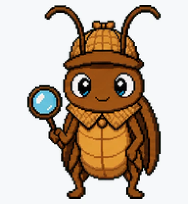
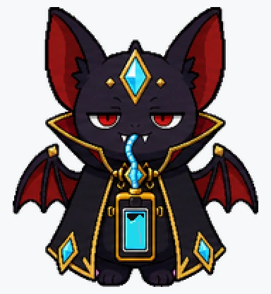
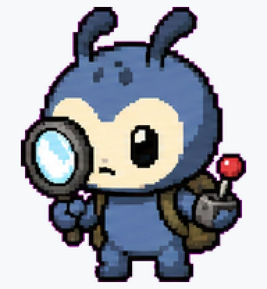
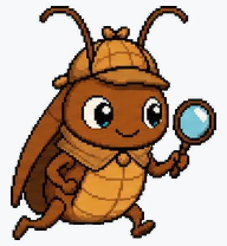
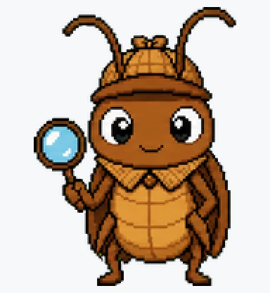
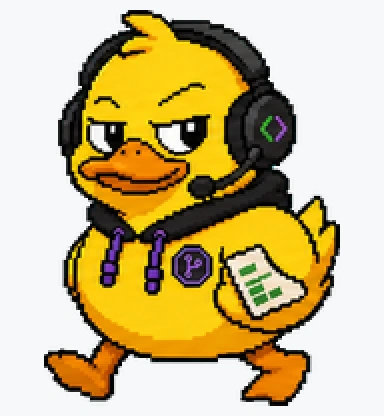
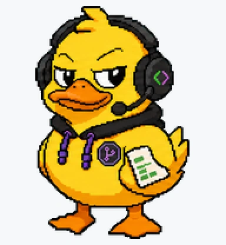
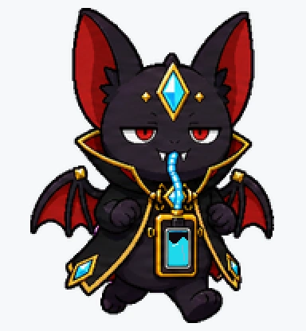
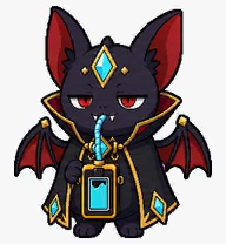

# Awesome Codex Pets

A growing pack of original, installable Codex `/pet` companions with GitHub-friendly previews, clean install notes, and a documented pet contract.

Pick a pet, copy one folder into `~/.codex/pets`, refresh Codex, and let a tiny agent companion live in your workspace.

> Seven pets ready: **Terminal Ghost**, **Review Owl**, **Bug Hunter**, **Bug Searcher**, **Rubber Duck 2.0**, **Token Vampire**, and **Ladybug Dev**.

<table>
  <tr>
    <td align="center"><a href="pets/terminal-ghost"><br><strong>Terminal Ghost</strong></a></td>
    <td align="center"><a href="pets/review-owl"><br><strong>Review Owl</strong></a></td>
    <td align="center"><a href="pets/bug-hunter"><br><strong>Bug Hunter</strong></a></td>
    <td align="center"><a href="pets/bug-searcher"><br><strong>Bug Searcher</strong></a></td>
  </tr>
  <tr>
    <td align="center"><a href="pets/rubber-duck-2-0"><br><strong>Rubber Duck 2.0</strong></a></td>
    <td align="center"><a href="pets/token-vampire"><br><strong>Token Vampire</strong></a></td>
    <td align="center"><a href="pets/ladybug-dev"><br><strong>Ladybug Dev</strong></a></td>
    <td align="center"><a href="docs/submit-your-pet.md"><br><strong>Suggest the next pet</strong></a></td>
  </tr>
</table>

## Quick Install

Clone the repo, then copy the pet you want into your Codex pets folder:

```bash
git clone https://github.com/gennadi-kuzmin/awesome-codex-pets.git
cd awesome-codex-pets
mkdir -p ~/.codex/pets
cp -R pets/terminal-ghost ~/.codex/pets/
```

Swap `terminal-ghost` for any folder name from [`pets`](pets):

```bash
cp -R pets/review-owl ~/.codex/pets/
cp -R pets/bug-hunter ~/.codex/pets/
cp -R pets/bug-searcher ~/.codex/pets/
cp -R pets/rubber-duck-2-0 ~/.codex/pets/
cp -R pets/token-vampire ~/.codex/pets/
cp -R pets/ladybug-dev ~/.codex/pets/
```

Then open Codex App, go to `Settings > Appearance > Pets`, refresh custom pets, select your pet, and type `/pet`.

See [`docs/install.md`](docs/install.md) for the full install guide.

## Choose A Pet

| Pet | Vibe | Preview | Install folder |
| --- | --- | --- | --- |
| [Terminal Ghost](pets/terminal-ghost) | Friendly CLI mascot with prompt-shaped eyes. | [](pets/terminal-ghost) | `pets/terminal-ghost` |
| [Review Owl](pets/review-owl) | Calm reviewer for PRs and code review mode. | [](pets/review-owl) | `pets/review-owl` |
| [Bug Hunter](pets/bug-hunter) | Tiny debugging detective. | [](pets/bug-hunter) | `pets/bug-hunter` |
| [Bug Searcher](pets/bug-searcher) | Cute bug-finding detective with a magnifying glass. | [](pets/bug-searcher) | `pets/bug-searcher` |
| [Rubber Duck 2.0](pets/rubber-duck-2-0) | Debugging duck upgraded into an AI coding buddy. | [](pets/rubber-duck-2-0) | `pets/rubber-duck-2-0` |
| [Token Vampire](pets/token-vampire) | Smug little bat drinking coding limits like token juice. | [](pets/token-vampire) | `pets/token-vampire` |
| [Ladybug Dev](pets/ladybug-dev) | Tiny coding ladybug with terminal-marked spots. | [](pets/ladybug-dev) | `pets/ladybug-dev` |

Click any pet name or preview to open its folder, full animation catalog, `pet.json`, and `spritesheet.webp`.

## Animation Catalog

Each pet folder has a full GitHub preview catalog. Newer pets include all nine Codex animation states.

| Pet | Idle | Running | Review | Full catalog |
| --- | --- | --- | --- | --- |
| Terminal Ghost | [](pets/terminal-ghost) | [](pets/terminal-ghost) | [](pets/terminal-ghost) | [Open](pets/terminal-ghost) |
| Review Owl | [](pets/review-owl) | [](pets/review-owl) | [](pets/review-owl) | [Open](pets/review-owl) |
| Bug Hunter | [](pets/bug-hunter) | [](pets/bug-hunter) | [](pets/bug-hunter) | [Open](pets/bug-hunter) |
| Bug Searcher | [](pets/bug-searcher) | [](pets/bug-searcher) | [](pets/bug-searcher) | [Open](pets/bug-searcher) |
| Rubber Duck 2.0 | [](pets/rubber-duck-2-0) | [](pets/rubber-duck-2-0) | [](pets/rubber-duck-2-0) | [Open](pets/rubber-duck-2-0) |
| Token Vampire | [](pets/token-vampire) | [](pets/token-vampire) | [](pets/token-vampire) | [Open](pets/token-vampire) |
| Ladybug Dev | [](pets/ladybug-dev) | [](pets/ladybug-dev) | [](pets/ladybug-dev) | [Open](pets/ladybug-dev) |

## Why This Exists

Codex pets are delightful, but the ecosystem is still young. This repo is a fast-moving open-source place for:

- original installable pets
- clear install instructions
- the exact Codex pet contract
- links to useful pet directories and examples
- community pet ideas

## Pet Contract

Codex custom pets live in your local Codex home:

```text
~/.codex/pets/<pet-name>/
├── pet.json
└── spritesheet.webp
```

See [`docs/pet-contract.md`](docs/pet-contract.md) for the exact `pet.json` and spritesheet contract.

## Star And Suggest

Star this repo if you want more Codex pets. Open an issue to suggest the next pet.

Have a pet idea? Open an issue with:

- name
- vibe
- visual style
- idle/working/waiting/done states
- whether the idea uses any third-party IP

Use [`docs/submit-your-pet.md`](docs/submit-your-pet.md) as a checklist.

## Validate

```bash
npm run validate
```

The validator checks each `pet.json` and warns when a pet does not have its `spritesheet.webp` yet.

## Best Examples

This repo focuses on original, installable pets. A few useful references:

- CodexPets.app: https://codexpets.app/
- Petdex: https://petdex.crafter.run/
- Codex Pet Shop: https://www.codexpetshop.com/
- OpenAI Codex Pets docs: https://developers.openai.com/codex/app/settings#codex-pets

More links live in [`docs/resources.md`](docs/resources.md).

## Follow The Builder

- X/Twitter: http://x.com/gennadi_kuzmin
- Telegram: https://t.me/kuzmin_904
- Email: gennadi.kuzmin@gmail.com

## License

Code and original documentation: MIT.

Pet artwork/assets should be original or used only with clear rights. Avoid uploading copyrighted characters, brand mascots, or third-party art you do not have permission to redistribute.
