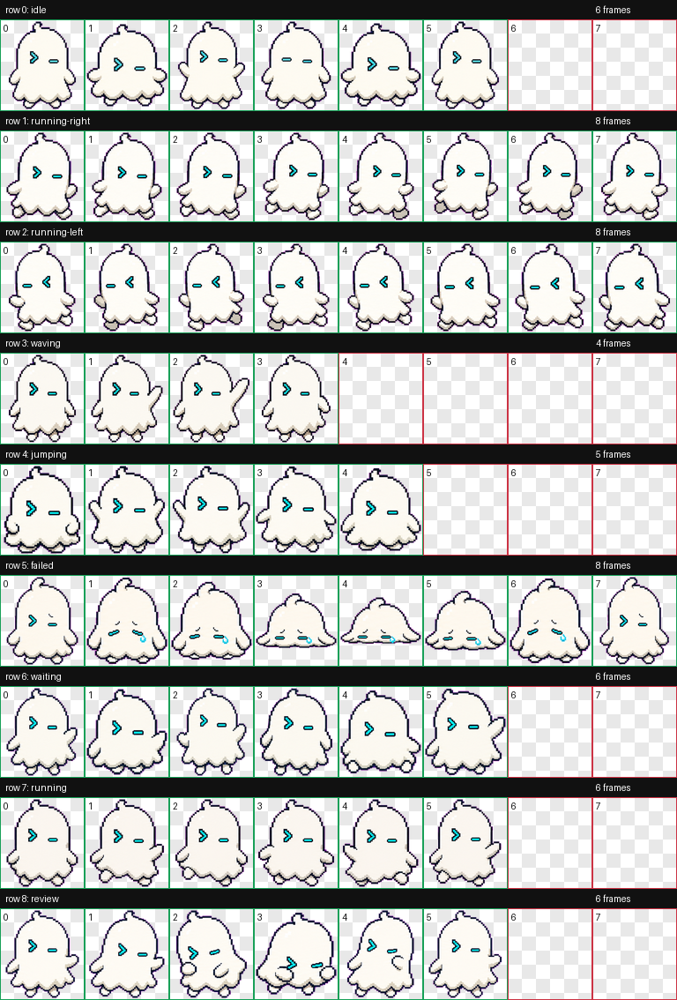

# Terminal Ghost

Friendly tiny CLI ghost for developers.



## Install

Copy this folder to:

```text
~/.codex/pets/terminal-ghost/
```

Then open Codex App, go to `Settings > Appearance > Pets`, refresh custom pets, select `Terminal Ghost`, and type `/pet`.

## Brief

Terminal Ghost is a small original Codex pet with prompt-shaped eyes like `>` and `_`, a subtle cyan terminal glow, and a curious helper mood.

## States

- Idle: gently floats and blinks.
- Working: emits terminal sparks or typing dots.
- Waiting: holds a blinking cursor.
- Done/review: shows a green check or prompt line.

## Prompt

```text
Create an original small animated Codex pet character named Terminal Ghost. It is a friendly tiny CLI ghost for developers, with prompt-shaped eyes like ">" and "_" and a subtle cyan terminal glow. Style: clean pixel-art inspired 2D sprite, readable at small size, transparent background, no copyrighted characters, no scary horror mood. The pet should feel curious, helpful, and slightly playful. Design animation-ready poses for idle, working, waiting for input, and ready for review.
```
